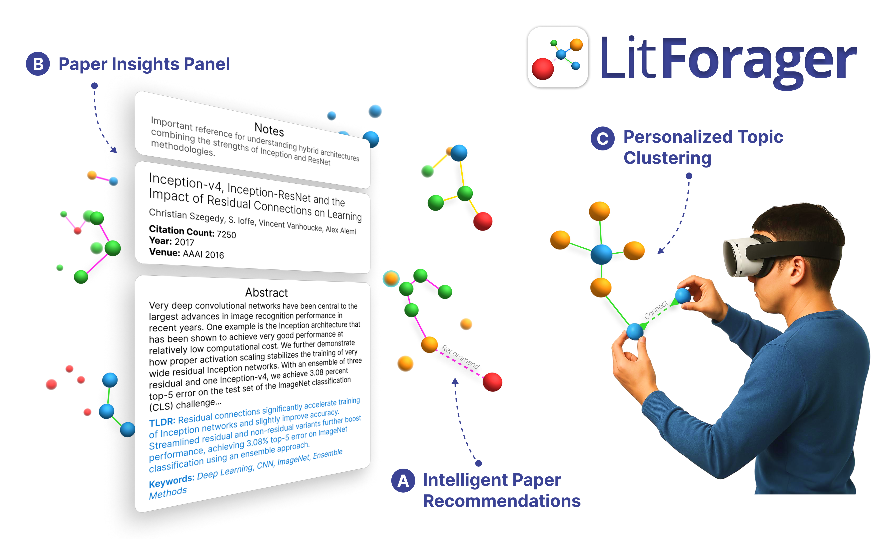

<p align="center">
  
</p>

# LitForager: Exploring Multimodal Literature Foraging Strategies in Immersive Sensemaking
[](https://opensource.org/licenses/MIT)
[](https://arxiv.org/abs/2508.15043)
[](https://www.ieeeismar.net/2025/program/papers/#october-9-2025-17-30-18-30-room-205-document-search)
[](https://www.doi.org/10.1109/TVCG.2025.3616732)

LitForager is an **immersive analytics system** designed to help researchers **forage, organize, and make sense of academic literature** using **interactive 3D network visualizations** and **multimodal interactions** (gesture, voice, and menus) in **VR**.

## Features

- **Immersive 3D Literature Network:** Visualize papers—retrieved from the **Semantic Scholar Open Research Corpus**—as nodes and their relationships (citations, authorship, thematic similarity, and custom links) as edges in an immersive spatial graph powered by **WebXR** and **Babylon.js**.
- **Multimodal Interaction:** Seamlessly interact with the system using hand gestures, voice commands, and WIMP-style hand menus.
- **Intelligent Recommendations:** Expand your literature network with recommendations based on thematic similarity, citation links, and author-centric exploration.
- **AI-Powered Insights:** Summarize papers and extract keywords using LLMs (e.g., **Gemini 2.5 Flash**).
- **Flexible Spatial Organization:** Arrange, cluster, and link papers in 3D space to externalize your understanding and support sensemaking.
- **Speech-Based Annotation:** Dictate and attach notes to papers without breaking your exploration flow.

## Quick Start

### 1. Clone the Repository

Clone the LitForager repository and navigate to the project directory:
```sh
git clone https://github.com/AlexanderHYang/LitForager.git
cd LitForager
```

### 2. Set Up the Multimodal LLM Backend

**a. Generate SSL Certificates**  
Create a `certificates` directory at `multimodal-llm/certificates` and generate self-signed certificates for local development:
```sh
mkdir -p multimodal-llm/certificates
openssl req -nodes -new -x509 -keyout multimodal-llm/certificates/key.pem -out multimodal-llm/certificates/cert.pem -days 365
```
> _Note: Do not commit your certificate files to version control._

**b. Configure Google Cloud APIs**  
- Follow the [Cloud Speech-to-Text Quickstart](https://cloud.google.com/nodejs/docs/reference/speech/latest#quickstart) to do the following:
  - Create or select a project, 
  - Enable the Cloud Speech API, 
  - Set up authentication
    - Follow the **user credentials** option, see [Google Cloud’s ADC setup guide](https://cloud.google.com/docs/authentication/set-up-adc-local-dev-environment#local-user-cred).

**c. Obtain a Gemini API Key**  
- Visit [Google AI Studio](https://aistudio.google.com/apikey) to generate a Gemini API key.
- When prompted, select the same Google Cloud project used for the Cloud Speech API.
- Create a `.env` file in the `multimodal-llm` directory and add your Gemini API key:
  ```
  GEMINI_API_KEY=your-gemini-api-key-here
  ```
- Refer to `multimodal-llm/.env.example` for the expected format.

**d. Install Backend Dependencies**  
```sh
cd multimodal-llm
npm install
```

### 3. Set Up the WebXR Frontend

**a. Add Your Semantic Scholar API Key**  
- Obtain your own Semantic Scholar API key from the [Semantic Scholar API Dashboard](https://www.semanticscholar.org/product/api).
- Create a `.env` in the project root and add your Semantic Scholar API key as follows:
  ```
  VITE_SS_API_KEY=your-semantic-scholar-api-key-here
  ```
  > _Note: Each user must use their own API key. Do not share or commit your key to version control._
- Refer to `.env.example` for the expected format.

**b. Install Frontend Dependencies**  
Open a new terminal in the project root and install frontend dependencies:
```sh
npm install
```

### 4. Launch LitForager

**a. Start the Backend**
```sh
cd multimodal-llm
node multimodal-llm.js
```

**b. Start the Frontend (with network access)**

In a new terminal window, run the following command from the **project root**:
```sh
npm run dev -- --host
```
This will display a network URL, e.g., `https://192.168.x.x:5173/`.

**c. Connect from Your VR Headset**
- First, in your VR headset’s browser, navigate to `https://192.168.x.x:3000/` (replace with your actual IP address) to trust the backend’s self-signed SSL certificate. Accept any security warnings to proceed.
- Next, open the displayed frontend network URL (ending in `5173`) in your VR headset’s browser.
- Click the headset icon in the bottom right to enter immersive mode and begin exploring.

## Credits

❤️ **LitForager** is a collaborative effort between [Georgia Tech](https://gatech.edu) and [Adobe Research](https://research.adobe.com/), created by [Alex Yang](https://alexanderyang.me), [Elliott Faa](https://www.linkedin.com/in/elliottfaa/), [Weijian Liu](https://www.linkedin.com/in/weijian-liu-77b643237/), [Shunan Guo](https://research.adobe.com/person/shunan-guo/), [Polo Chau](https://poloclub.github.io/polochau/), and [Yalong Yang](https://ivi.cc.gatech.edu/pi.html).

💙 LitForager draws inspiration from [Anu.js](https://jpmorganchase.github.io/anu/) ([GitHub Repo](https://github.com/jpmorganchase/anu)), an open-source immersive analytics toolkit by JPMorgan Chase. We thank the Anu.js team for their pioneering work in immersive data visualization.

## Citation

```bibTeX
@article{yang2025litforager,
  author={Yang, Haoyang and Faa, Elliott H. and Liu, Weijian and Guo, Shunan and Chau, Duen Horng and Yang, Yalong},
  journal={IEEE Transactions on Visualization and Computer Graphics}, 
  title={LITFORAGER: Exploring Multimodal Literature Foraging Strategies in Immersive Sensemaking}, 
  year={2025},
  volume={},
  number={},
  pages={1-11},
  keywords={Systematic literature review;Interviews;Three-dimensional displays;Iterative methods;Organizations;Pain;Hands;Electronic mail;Cognition;Annotations;Immersive analytics;immersive sensemaking;information foraging;literature exploration;multimodal interaction},
  doi={10.1109/TVCG.2025.3616732}}
}
```
## License

**LitForager** is available under the MIT License. It uses the **Semantic Scholar Open Research Corpus API** (licensed under [ODC-BY](https://opendatacommons.org/licenses/by/)), as described in *Waleed Ammar et al. 2018. Construction of the Literature Graph in Semantic Scholar. NAACL*. LitForager also integrates **Gemini 2.5 Flash** (provided under [Google’s Generative AI Terms of Service](https://ai.google.dev/terms)), relies on **WebXR technologies** and libraries such as [Babylon.js](https://www.babylonjs.com/) (Apache 2.0 License), and is inspired by [Anu.js](https://github.com/jpmorganchase/anu) (Apache 2.0 License).
